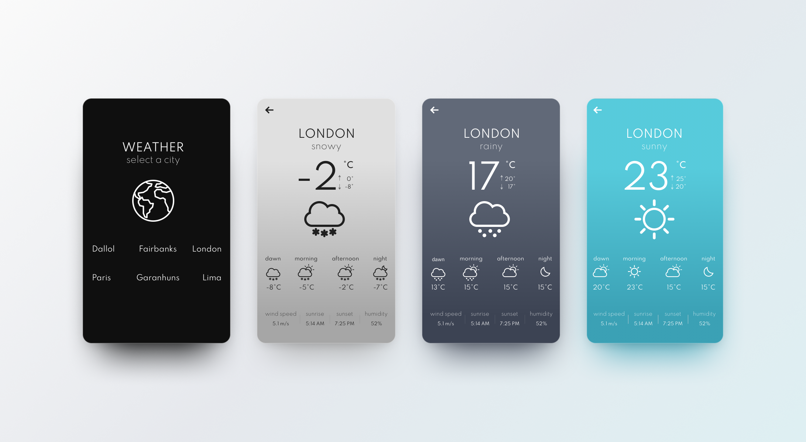

# Projeto de Teste para vaga ReactJS Pleno.

## Sobre o desafio
Criar uma página web que, ao escolher uma cidade, leia as informações do clima dela através de uma API.

Opções de API para utilização:
* [Open Weather API](https://openweathermap.org/current)
* [Weather API](https://www.weatherapi.com/)

## Layout

  https://explosion.invisionapp.com/public/share/SX19J12TJR#screens/476656918

## Requisitos de Avaliação

* As cidades devem ser: 
  * Dallol(NG), 
  * Fairbanks(US), 
  * Londres(GB), 
  * Caruaru(BR),
  * Vancouver(CA),
  * Yakutsk(RU)
* Fidelidade ao Layout enviado
* Responsividade
* Implementação de testes unitários
* Framework Javascript: React;

Desejáveis:
* Mobile First
* Fazer o uso de pré-processadores CSS e/ou biblioteca UI

## Observações

* Você deve usar o ícone do layout que melhor se encaixa em cada condição climática
* Considere os horários `3:00`, `9:00`, `15:00` e `21:00` para a definição das temperaturas de `Dawn`, `Morning`, `Afternoon` e `Night` respectivamente. 

## Diferenciais

* Rodas a aplicação fazendo o uso de um container Docker.

 
---
_O envio pode ser feito com um link de repositório Git_
